# AI 影片示範教學網站：Learning Analytics Tools（NTNU）

國立臺灣師範大學學習分析工具課程的 AI 示範教學網站：AI 教學影片、學生參與的互動複習，以及學生作品展示。網站程式開源（MIT），AI 教學影片與教材開放授權（CC BY-NC-SA 4.0，限非商業使用）；製作影片用的教學影片生成 prompt 與經驗也會陸續公開（規劃中）。

An AI teaching-video demonstration site for the Learning Analytics Tools course at National Taiwan Normal University (NTNU): AI-made teaching videos, interactive review for students, and a student work showcase. The code is open source (MIT), and the AI teaching videos and course material are openly licensed for non-commercial use (CC BY-NC-SA 4.0). The prompts and production experience behind the videos will be released too (planned).

[](LICENSE) [](LICENSE-CONTENT.md) [](https://learning-analytics-tools.pages.dev/)

繁體中文 ｜ [English](#english)

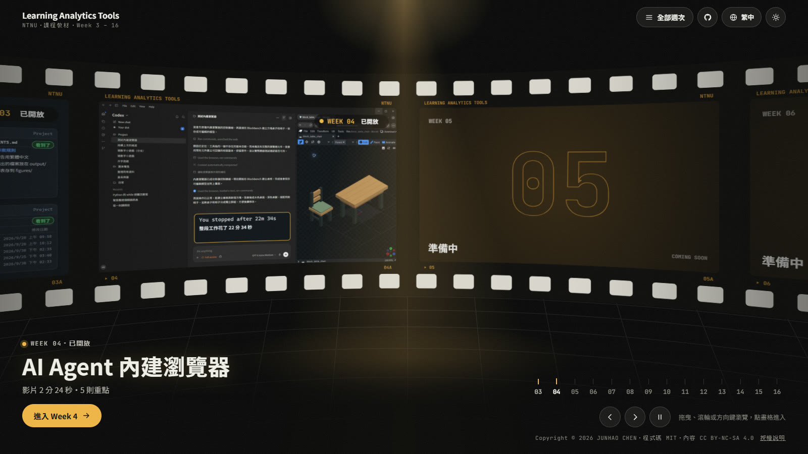

## 繁體中文

這是臺師大課程 Learning Analytics Tools Implementation Applications 的教材網站，也是一個公開的 AI 示範教學實例：這門課教學生怎麼和 AI 工具合作，而這門課自己的教學影片，也是用 AI 工具做出來的。網站程式碼以 MIT 授權開源，影片與教材內容以 CC BY-NC-SA 4.0 開放授權（限非商業使用）。

每週的 AI 教學影片由 Claude Code 以程式碼製作，授課教師提供教材、選定方向，並在每個階段審核。學生在網站上看短影片、點章節、讀重點，依自己的步調互動複習；學生同意公開的作業作品，也在這裡的[作品集](https://learning-analytics-tools.pages.dev/works/)展示。製作這些影片用的教學影片生成 prompt 與製作經驗，會陸續整理公開（規劃中）。

網站：<https://learning-analytics-tools.pages.dev/>

### 開源與開放授權：可以直接使用、也可以參考的部分

這個 repo 就是網站本身，網站上的每一個檔案都在這裡。

- 網站程式（MIT）：每週一頁的版型、HLS 影片播放、章節時間軸、播放清單與觀看進度、四種語言、深淺色主題、首頁膠捲、學生作品集。純 HTML、CSS、JavaScript，沒有建置步驟，也沒有 npm 套件；唯一內附的函式庫是 hls.js。
- 發布影片的工具（MIT）：`tools/new-video.sh` 建立新影片和週次頁，`tools/publish-video.sh` 把 mp4 轉成 HLS 並擷取封面與縮圖，`tools/add-works.mjs` 匯入學生作品（遮蔽學號、檢查、截縮圖），`tools/check.mjs` 在推上去之前檢查連結、檔案大小和翻譯是否齊全（只用 Node.js 內建模組）。
- AI 教學影片與課程文字（CC BY-NC-SA 4.0）：非商業用途可以使用、改作，標示出處並以相同授權分享即可。
- AI 教學影片的做法：見下方「AI 教學影片怎麼做」，從教材來源、動態素材、三個方案、結構化 prompt，到審查與發布。
- 教學影片生成 prompt 與製作經驗（規劃中）：每支影片的結構化 prompt（`brief.md`）、素材規格、審查紀錄和學到的教訓，移除個人資訊後陸續公開。

### 教學目標

- 學會使用 AI Agent：學習分析工具課程教學生實際使用 AI Agent（例如 Codex 這類 AI 程式助理），包括工作資料夾與路徑、用 `AGENTS.md` 當長期記憶、管理上下文，以及讓 AI 操作瀏覽器。
- AI 示範教學：教材影片本身也是在教師指導下用 AI 工具做出來的。學生看到課程內容，也同時看到一套完整的做法：教師負責教材、方向和品質，AI 負責大部分的製作工作。
- 學生參與：短影片、可以點的章節和精簡的重點，讓學生挑自己需要的段落回看；作業影片示範常見的錯誤和比較好的做法，再讓學生用 AI Agent 動手完成實際的任務。作業作品放在網站的「作品集」，同學可以互相觀摩。
- 教材的嚴謹：影片裡的事實只取自教師的投影片與教材。影片中的學生是虛構角色「小安」，畫面模仿真實的介面（Week 4 的 Blockbench 段落是教師實際操作的瀏覽器錄影），但不出現真實的帳號、路徑或學生資料。
- 公開、可重複使用：程式碼開源、內容開放授權，製作方法寫在下方，prompt 與製作經驗也會陸續公開（規劃中）；其他教師可以檢視、改作，用在自己的課程（教材內容限非商業用途），不必從頭做起。

### AI 教學影片

目前（2026 年 10 月）已公開 Week 3「AI 助理的工作資料夾」、Week 4「AI Agent 內建瀏覽器」與 Week 5「讓 Codex 做對：驗證與 context window」：共 6 支影片加 4 支補充教材（合計 31 分鐘）、92 個章節、53 則重點。Week 6 到 Week 16 依課程進度陸續開放，網站上先顯示「準備中」。

影片沒有旁白，用動畫、字卡和程式合成的配樂說明一個主題，長度從 1 分多到 4 分鐘左右。課程教的是 AI 程式助理的實際用法，影片中示範的工具主要是 OpenAI 的 Codex。

| | 影片 | 長度 | 章節／重點 | 內容 |
|---|---|---|---|---|
| 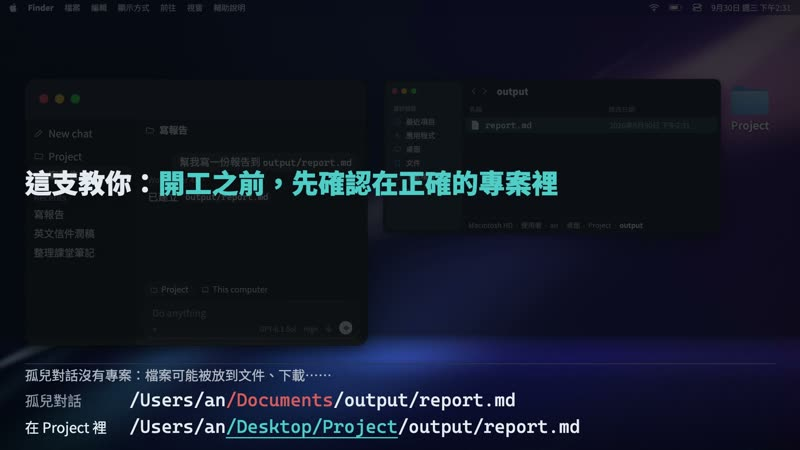 | Week 3・01<br>[report.md 的旅程](https://learning-analytics-tools.pages.dev/weeks/week03/#01-report-journey) | 1:24 | 8／5 | 把資料夾拖進 Codex 變成專案；在專案外開的對話會把檔案放到別處，怎麼找回來、開工前要確認什麼 |
|  | Week 3・02<br>[AGENTS.md 與上下文管理](https://learning-analytics-tools.pages.dev/weeks/week03/#02-agents-md-context) | 3:24 | 12／5 | 用 `AGENTS.md` 當長期記憶；上下文視窗是短期記憶，噪音、幻覺與成本；編輯、分支與 side chat |
| 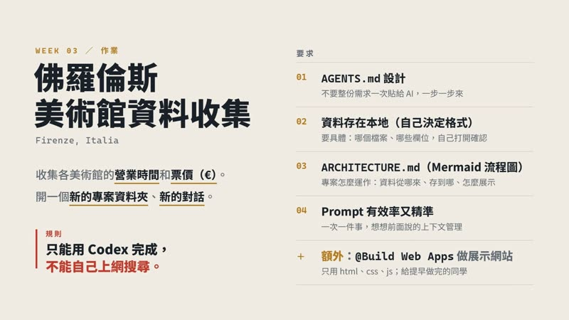 | Week 3・03<br>[作業：佛羅倫斯美術館資料收集](https://learning-analytics-tools.pages.dev/weeks/week03/#03-homework-firenze) | 2:43 | 8／6 | 只用 Codex 收集美術館資料：先看把整份題目貼給 AI 的錯誤示範，再規劃 `AGENTS.md`、資料存在本地並自己確認、`ARCHITECTURE.md` 流程圖、有效率又精準的 prompt |
| 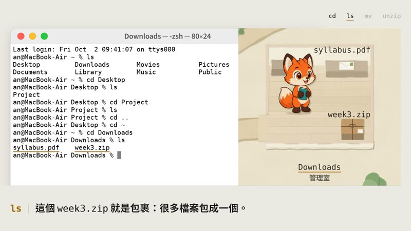 | Week 3・補充 1<br>[終端機介紹（Mac）](https://learning-analytics-tools.pages.dev/weeks/week03/#s1-terminal-mac) | 4:01 | 10／6 | 什麼是終端機、怎麼打開、看懂提示字元；用狐狸小安收包裹的故事教 `~`、`cd`、`ls`、`mv`、`unzip`，最後照同一個故事練習（附練習檔 `week3.zip`） |
| 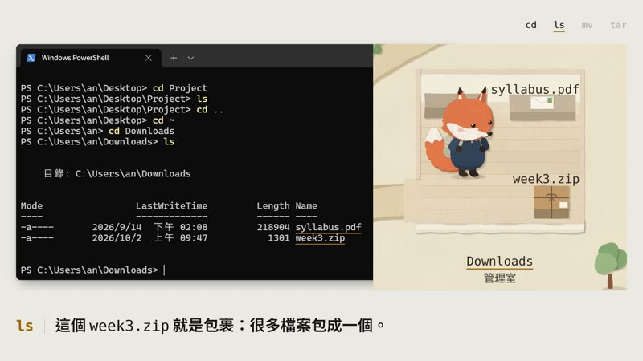 | Week 3・補充 2<br>[終端機介紹（Win）](https://learning-analytics-tools.pages.dev/weeks/week03/#s2-terminal-win) | 4:03 | 10／6 | 同一個狐狸小安的故事搬到 Windows 11：從搜尋打開終端機、看懂 `PS C:\Users\an>` 提示字元、`ls` 的表格輸出、`mv`，解壓縮改用內建的 `tar -xvf`；練習頁加上 OneDrive 桌面的提醒 |
| 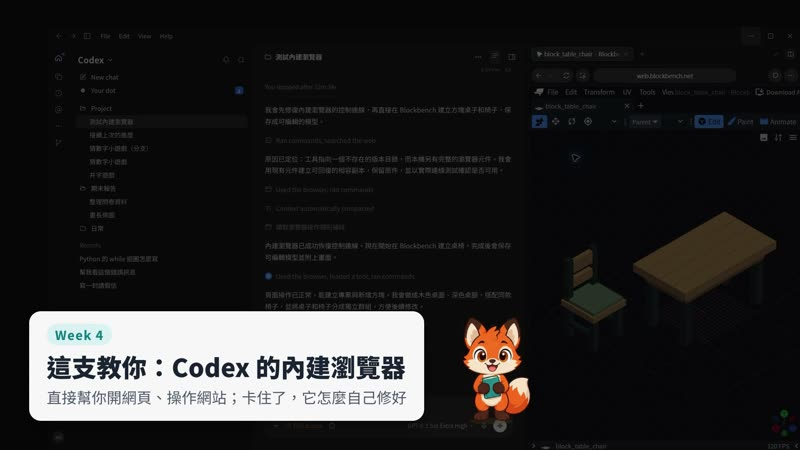 | Week 4・01<br>[AI Agent 內建瀏覽器](https://learning-analytics-tools.pages.dev/weeks/week04/) | 2:24 | 8／5 | AI Agent 控制瀏覽器的五種方法；Codex 內建瀏覽器卡住後，Codex 自己找出原因並修好，再實際在 Blockbench 做出方塊桌椅（22 分 34 秒的操作，影片中加速播放） |
| 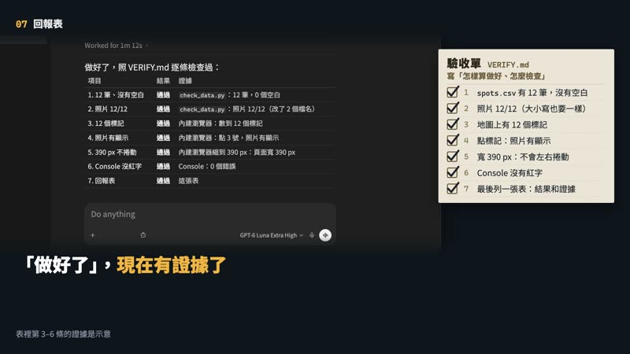 | Week 5・01<br>[怎樣才算做好：寫一份驗證清單](https://learning-analytics-tools.pages.dev/weeks/week05/#01-verify-md) | 3:26 | 10／5 | Codex 說「做好了」是它自己判斷的：`AGENTS.md` 是家規（怎麼做），`VERIFY.md` 是驗收單（怎樣算做好、怎麼檢查），每一條都寫清楚看什麼、怎麼看、應該看到什麼（依 OpenAI〈Codex Best practices〉）。例子是小安的銀杏散步地圖：清單抓到照片檔名的大小寫不一樣（Mac 看不出來，放上網站才破圖），修好再檢查，最後交一張附證據的回報表 |
| 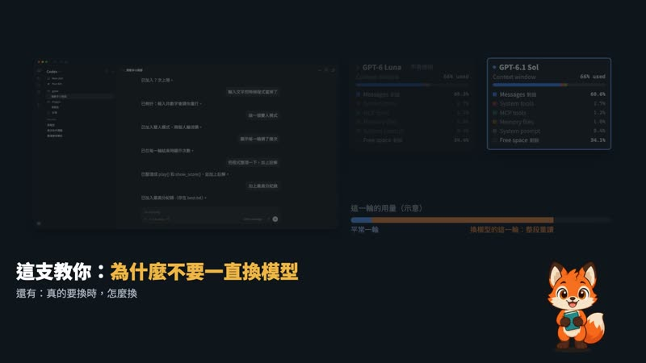 | Week 5・02<br>[不要一直換模型](https://learning-analytics-tools.pages.dev/weeks/week05/#02-model-switch) | 1:40 | 6／5 | 每個模型有自己的 context window；做到一半從 GPT-6 Luna 換成 GPT-6.1 Sol，Sol 要整段重讀、快取失效，用量一次跳高（依 OpenAI〈Unrolling the Codex agent loop〉）；開工前選好模型，真的要換就先請原本的模型寫交接摘要、開新對話。context window 面板借用 Claude Code 的 `/context` 當示意圖 |
| 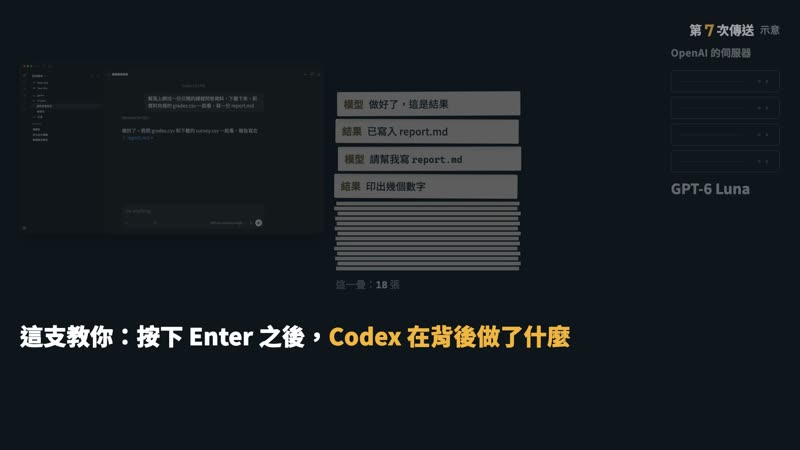 | Week 5・補充 1<br>[按下 Enter 之後，Codex 做了什麼](https://learning-analytics-tools.pages.dev/weeks/week05/#s1-codex-loop) | 4:14 | 10／5 | 用「一疊紙條」講 Codex 背後的流程：模型在 OpenAI 的伺服器只讀寫文字，Codex 在你的電腦上動手；按一次 Enter，背後來回很多次（依 OpenAI〈Unrolling the Codex agent loop〉）。讀檔、上網搜尋（在 OpenAI 那邊）、下載（預設沙箱不能連網，要你允許）、寫程式分析、寫檔，每一步的結果都疊進 context window；讀過的內容會送到 OpenAI，個資先換成代號 |
| 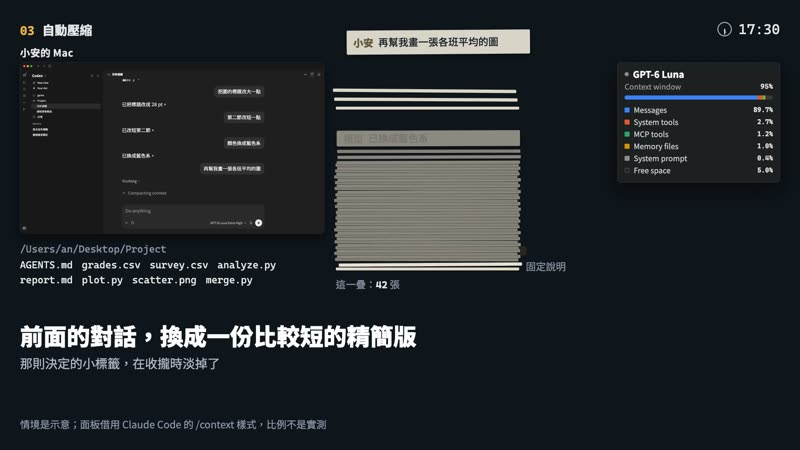 | Week 5・補充 2<br>[對話滿了會怎樣](https://learning-analytics-tools.pages.dev/weeks/week05/#s2-context-full) | 3:12 | 10／5 | 同一疊紙條疊到頂：快滿時 Codex 自動壓縮，前面的對話換成精簡版，活動紀錄出現「Context automatically compacted」；精簡版可能掉了「缺考不算進平均」這種決定，新圖的數字就對不起來。Codex 原始碼裡的提醒：長對話和多次壓縮可能讓模型比較不準。兩個習慣：一件事一段對話、要一直遵守的事寫進 `AGENTS.md` |

### 學生參與和互動複習

網站的形式是「每週：短影片＋幾則重點」，讓學生課後回來複習，也能和影片互動：

- 作業：Week 3 影片 03 是作業說明。學生只用 AI Agent（Codex）動手完成一個資料收集任務：先規劃 `AGENTS.md` 的規則，把資料存在本地並自己確認，再用 Mermaid 在 `ARCHITECTURE.md` 畫出流程。提早做完的同學，可以再用 `@Build Web Apps` 做一個簡單的展示網站。
- 課堂練習（練習用的模擬電腦）：Week 3 的最後有兩台在瀏覽器裡執行的模擬電腦，Mac 和 Windows 左右並排讓學生自己選（直接進入 [Mac](https://learning-analytics-tools.pages.dev/lab/mac/)、[Windows](https://learning-analytics-tools.pages.dev/lab/win/)，也在 [Week 3 頁面](https://learning-analytics-tools.pages.dev/weeks/week03/#lab-mac)的播放清單「課堂練習」裡）。它不是影片，是可以真的操作的練習環境：共 10 個任務，分三組：認識桌面和 Finder；終端機的五個小任務（`ls` 看一圈、`cd` 走路、`mv` 搬東西、`unzip` 拆包裹、`mkdir` 和 `open`）；Codex 的四個任務（把 Project 拖進 Codex 並按 Trust folder、請 Codex 做事並找 `report.md` 落在哪、New chat 的陷阱、`AGENTS.md`）。連線後先從任務選單挑一個（可以直接選「cd 走路」），再照任務卡一步一步做：要點的地方會彈跳或框起來提示，做對了會自動打勾，配上短短的提示音，任務完成時有紙片彩帶；卡住可以按「提示」，弄壞了隨時重來。純前端、沒有後端，也不存任何東西：每次進入都是一台全新的電腦，重新整理或離開後這次的進度不會留下；畫面是繁體中文，建議用電腦（滑鼠和鍵盤）操作。兩台都盡量做得像真的電腦：終端機支援大量指令（結果用假資料），也有系統設定、計算機、活動監視器／工作管理員、離線的瀏覽器，要離開時按上方中間的「中斷連線」。
- 章節：一週一頁，每支影片下方是章節和編號重點。點章節就跳到那個時間播放，正在播的章節會標示出來。
- 時間連結：週次頁網址加上 `#t=30`，會從這週第一支影片的第 30 秒開始播放；加上 `#02-agents-md-context&t=30` 則指定某一支影片的某一秒。教師可以把連結貼給學生，指到要複習的那一刻，例如 [Week 3 影片 02 的第 30 秒](https://learning-analytics-tools.pages.dev/weeks/week03/#02-agents-md-context&t=30)。
- 播放清單與觀看進度：一週有兩支以上影片時，頁面自動變成播放清單。每支有縮圖、長度和觀看進度，看到 95% 以上會打勾；播完會出現「下一支」，點了才播。沒選到的影片不會先下載，一次只播一支。桌機的清單在右側，手機的清單在播放器上方，可以左右滑動。
- 不追蹤學生：觀看進度只存在學生自己的瀏覽器，不會上傳。網站不需要登入，也沒有任何分析或追蹤程式。
- 四種語言：繁體中文（預設）、简体中文、English、Tiếng Việt。網址加 `?lang=zh-Hans`、`?lang=en` 或 `?lang=vi`，就是指定語言的連結，可以直接分享。影片畫面裡的字是繁體中文；切換到其他語言時，標題、章節和重點都有翻譯，週次標題下也會說明這一點。
- 首頁膠捲：片頭加 Week 3 到 Week 16 各一格，已開放的週次顯示影片封面，其他顯示「準備中」。可以拖曳、滑動、用滾輪或方向鍵捲動，點畫格進入那一週。膠捲以原生 WebGL2 繪製、不用任何函式庫，停住時不重畫，手機只載入小縮圖；瀏覽器不支援 WebGL2 時，改顯示週次清單。
- 深色與淺色主題（預設跟隨系統）、手機版面、螢幕閱讀器標示（ARIA）；系統設定為減少動態效果時，網站的動畫也會減少。

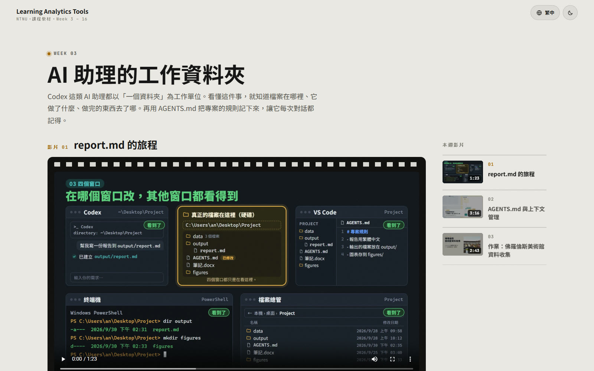

### 學生作品展示

網站上方的「[作品集](https://learning-analytics-tools.pages.dev/works/)」展示學生同意公開的作業網頁：

- 依作業分類（第一個是 Week 4 的 HW1），每件作品一張縮圖；點開後直接在網站裡瀏覽學生做的網頁，可以切換上一位、下一位，或在新分頁開啟。
- 老師推薦的作品標上 ★（最多三顆），排在最前面，給同學參考。
- 只收錄學生同意公開的作品（同意公開也包括放在這個公開的 GitHub repo），學生也可以隨時要求撤下。
- 作品只以遮蔽後的學號標示（通常只露出前 2 碼和後 3 碼，和別人重複時再多露出一碼，直到分得開）；完整學號與對照表不會放進這個公開的 repo。
- 學生作品的著作權屬於學生本人，不適用本專案的授權（見「授權」與 [NOTICE.md](NOTICE.md)）。

### AI 教學影片怎麼做

影片的畫面主要是用 HTML、CSS、JavaScript 寫成的動態網頁，逐格渲染成影片。例外有兩處：Week 4 影片 01 的 Blockbench 段落是教師實際操作的瀏覽器錄影（加速播放），嵌在程式畫的 Codex 介面裡；Week 3 影片 03 開頭用了三張 Wikimedia Commons 的圖片。畫面都不是影片生成模型產生的。每支影片都由教師和 Claude Code（Claude Opus）合作完成，使用 opus-video skill（原作者為周行 Kianzzz，MIT 授權；本課程使用依需求調整過的版本）。Claude Code 寫程式產生畫面和聲音，教師在每個階段確認。影片教的是 Codex 等 AI 程式助理的用法：Codex 是教學主題，不是做影片的工具。

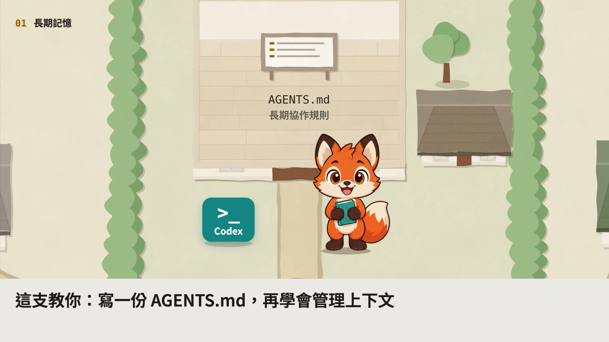

1. 教材來源：教師的投影片、先前的課程網頁或螢幕錄影。影片裡的事實只能來自這些來源。
2. 動態素材先確認：投影片先由 Claude Code 的子代理做成一段段 12–20 秒的動態畫面（HTML/CSS/JS），教師在總覽頁確認後才規劃影片。這一步從 Week 3 影片 02 開始採用。
3. 三個方案：提出三個方向不同的影片方案（穩健、新的視覺語言、大膽的結構），各附一張預覽畫面或幾秒的試片，由教師選定。Week 3 影片 03 沿用影片 02 的做法，省略了這一步。
4. 結構化 prompt：選定後寫成 `brief.md`，分成 `<role>` `<inputs>` `<direction>` `<structure>` `<build>` `<gotchas>` `<start>` 等區塊（Week 3 影片 03 沒有 `<start>`），是這支影片完整的製作指示，也可以換個主題重複使用。這些 `brief.md` 就是規劃公開的「教學影片生成 prompt」。
5. 用程式碼渲染：每一格畫面只由時間 t 決定（GSAP 時間軸、HyperFrames），不用計時器，需要亂數時也固定種子，所以任何一格都能單獨重新渲染；用 Playwright 與 HyperFrames 逐格渲染，再由 FFmpeg 輸出 1920×1080、30 fps 的影片。
6. 聲音也用程式合成：不用旁白和現成音樂；配樂與音效用 numpy、SciPy 合成，音效對準畫面上動作發生的那一格，響度統一為 -27 LUFS。
7. 審查：製作中抽查靜態影格或樣片，成片一定看縮圖總表（包括手機寬度）。每一輪由 Claude Code 依開場、手機可讀、動作自然、畫面變化、構圖、音畫同步、貼合原始素材七項自評（10 分制），每項都到 8 分以上才交付，每一輪都有紀錄。教師看過後指出的問題，會寫成之後每支影片都要遵守的規則。
8. 發布：`tools/publish-video.sh` 把成品重新壓縮成 H.264、切成 8 秒一段的 HLS，擷取封面（1920×1080）和縮圖（800×450），放進網站的影片資料夾；push 到 `main` 後上線。

### 開源與開放內容的範圍與規劃

| 項目 | 狀態 |
|---|---|
| 網站程式（HTML、CSS、JavaScript）、工具（`tools/`）、範本與說明文件 | 已公開，MIT 授權 |
| AI 教學影片（HLS）、封面、縮圖，以及每週的文字（繁體中文原文與簡中、英文、越南文翻譯） | 已公開，CC BY-NC-SA 4.0 |
| Week 6 到 Week 16 | 依課程進度陸續開放 |
| 學生作品展示（作品集） | 已上線，陸續加入學生同意公開的作品；著作權屬於各作者 |
| 練習用的模擬電腦（課堂練習） | Mac 版、Windows 版都已上線（Week 3 的 10 個任務，可以直接選；終端機、系統設定、檔案管理都可以真的操作） |
| 教學影片生成 prompt：每支影片的 `brief.md`、動態素材規格、三方案提案 | 規劃中，整理後公開 |
| 製作經驗：逐輪審查紀錄與整理過的教訓 | 規劃中，整理後公開 |
| 製作專案（場景程式、音訊腳本）與 mp4 原檔 | 目前不在這個 repo；repo 只放要公開的成品 |
| 原始投影片、螢幕錄影原檔、介面截圖（Week 4 影片 01 只放剪輯、加速後的片段） | 不公開：含未發布的教材或個人資訊 |

公開 prompt 與經驗之前，會先移除本機路徑、帳號和私人備註，把只在本機能用的指令改成通用的寫法；用到 opus-video skill 的文字或程式時，會保留原作者的 MIT 授權聲明。公開的每個檔案都會標明授權，其中的腳本與程式以 MIT 授權。

目前已經累積、之後會寫進經驗分享的幾件事：

- 先做動態素材讓教師確認，再做整支影片；在素材階段修改，成本低很多。
- 連續播放的素材，故事要前後一致：檔案順序、對話標題、時間和資料夾內容都要對得上。
- 同一個角色，同一時間在畫面上只能出現一個。
- 審查不能只看畫面好不好看，還要追每一條路線、箭頭和事件順序是否合理。第一支影片的前三輪自評（第 3 輪每項都已到 8 分以上）都沒發現走不通的路線、缺少的讀取路線，以及檔案還沒送到就先出現「完成」的對話框；是教師指出線路看起來不對，重新逐條檢查才找到。這支影片前後共經過 8 輪審查。
- 開場前兩秒就要有抓住人的畫面：第一支影片原本 10 秒後主角才出現，改成一開始先放兩個對話泡泡。
- 鏡頭移動要慢而穩，不用快速旋轉，也不用「唰」一聲的音效。
- 避免「AI 感」的版面：每行加框、膠囊、圖示、發光卡片、圓形編號。作業的任務卡因此重做成米色紙張的排版。
- 手機上要讀得清楚：說明文字在 1920×1080 的畫面上至少 28 px，每段字至少停留 2.5 秒。
- 響度直接標準化到 -27 LUFS，不加限幅器；合成的每個聲音都淡出到 0，避免爆音。

### 用在你自己的課程

網站是純 HTML、CSS、JavaScript，沒有建置步驟，也沒有 npm 套件，可以 fork 後改成自己的課程網站。

```bash
git clone https://github.com/bigmoumou/Learning-Analytics-Tools.git
cd Learning-Analytics-Tools
python -m http.server 8000
```

然後用瀏覽器打開 <http://localhost:8000/>。直接雙擊 `index.html` 也能開，但瀏覽器的安全限制會讓封面圖和影片顯示不出來。

改成自己的課程時，請注意：

1. `assets/course.js`：週次範圍（`firstWeek`、`lastWeek`）和每週資料（`WEEKS`）。課程名稱、「NTNU」和「Week 3 – 16」另外直接寫在下面這些地方，要一起改（`course.js` 開頭 `COURSE` 的 `title`、`subtitle`、`repo` 目前沒有被用到）：各頁面和 `tools/template/week.html.tmpl` 的品牌列與頁尾；`index.html` 和 `404.html` 的 `<title>` 與 meta description；`assets/i18n-strings.js` 的 `brand.sub`（「NTNU・課程教材・Week 3 – 16」）、`home.doc`、`404.doc`、`home.desc`、`home.leaderTitle`（四種語言）；`assets/home.js` 畫在膠捲片頭上的文字。`tools/new-video.sh` 也只接受第 3 到 16 週。
2. 每一頁 `<head>` 最前面有一段程式，會把 `*.github.io` 的訪客轉到 learning-analytics-tools.pages.dev（`404.html` 和 `tools/template/week.html.tmpl` 也有；不改的話，放在 GitHub Pages 的副本會把訪客送到這個網站）；`_redirects` 是這個網站自己的舊網址轉址；首頁頂端列和頁尾有本 repo 的 GitHub 連結，各頁頁尾的「授權說明」也連到本 repo。請改成你的網址或拿掉，`tools/check.mjs` 裡對應的檢查也要一起改。
3. 頁尾的著作權聲明在各頁面、範本和 `assets/i18n-strings.js` 裡，請改成你自己的，`tools/check.mjs` 裡的版權字串也要一起改。各頁面和範本 `<head>` 的 `author`、`copyright` meta 也要改；`CITATION.cff` 請改成你自己的資料或刪掉。`LICENSE` 裡的 MIT 條款與原作者的著作權聲明請保留；換成自己的影片和文字後，`LICENSE-CONTENT.md` 也要改成你自己的內容授權，`NOTICE.md` 保留 hls.js 的聲明，其他項目依你的內容調整。
4. 新增影片：`tools/new-video.sh <週次> <NN-slug> <標題>` 從 `tools/template/` 建立週次頁和影片段落，並在 repo 旁邊建立 `../製作/` 的製作資料夾（不在 git 裡）。影片用什麼工具做都可以，只要最後是一個 mp4，再用 `tools/publish-video.sh` 轉成 HLS（需要 FFmpeg）。這兩個是 bash 腳本，Windows 可以用 Git Bash 執行。推上去之前執行 `node tools/check.mjs`（需要 Node.js，只用內建模組）。
5. 部署：本網站用 Cloudflare Pages，push 到 `main` 就自動部署。影片只放 HLS，因為 Cloudflare Pages 不支援 Range 請求，mp4 放上去無法跳到指定時間；單一檔案不能超過 25 MiB，工具都會檢查。網站是純靜態檔案，原則上也能放在其他靜態網站主機。

只沿用程式碼時依 MIT 授權；沿用本課程的影片或文字時，請遵守 CC BY-NC-SA 4.0：標示出處、非商業使用、改作後以相同授權分享。

給維護者的完整說明（資料夾結構、新增影片、影片與 HLS 規則、多語系、版權與授權、本機預覽）在 [docs/維護說明.md](docs/維護說明.md)。

### 參與貢獻

歡迎修課同學、教師和任何讀者一起改進：

- 回報問題：在 [Issues](https://github.com/bigmoumou/Learning-Analytics-Tools/issues) 寫下錯字、說明不清楚的地方、翻譯問題、影片無法播放、手機版面，或無障礙的問題（螢幕閱讀器、鍵盤操作），請附上頁面網址、瀏覽器和裝置。
- 修正錯字或翻譯：可以直接送 Pull Request。週次頁的翻譯寫在 `data-zh-hans`、`data-en`、`data-vi` 屬性裡（屬性裡的引號用「“ ”」，不要用 `"`），首頁的週次標題與摘要在 `assets/course.js` 的 `WEEKS[n].i18n`，全站共用的介面文字在 `assets/i18n-strings.js`；完整規則見 [docs/維護說明.md](docs/維護說明.md) 的「多語系」。
- 影片和教材內容的修改，以及較大的程式修改，請先開 Issue 討論；送出前請執行 `node tools/check.mjs`，確定沒有錯誤。
- 除非另外說明，送進來的程式碼以 MIT 授權，教材內容的修改以 CC BY-NC-SA 4.0 授權。
- 請不要在 Issue 或 Pull Request 裡寫出學生的姓名、學號或其他個人資料。

### 授權

程式碼以 MIT 授權開源；教材內容採開放授權，限非商業使用，屬於開放式教育資源（OER），不算開源軟體。

- 程式碼：[MIT](LICENSE)。包括 HTML 結構、CSS、JavaScript（`assets/` 裡的程式，含 `assets/i18n-strings.js` 的介面文字；`assets/vendor/` 的 hls.js 除外）、`tools/` 與範本、`_redirects` 與 `404.html`，以及說明文件（`README.md`、`docs/維護說明.md`）。
- 教材內容：[創用CC 姓名標示-非商業性-相同方式分享 4.0 國際](https://creativecommons.org/licenses/by-nc-sa/4.0/deed.zh-hant)（CC BY-NC-SA 4.0），著作權人 JUNHAO CHEN，見 [LICENSE-CONTENT.md](LICENSE-CONTENT.md)。包括 `weeks/*/video/` 裡的影片、封面與縮圖，`weeks/*/lab/` 裡的課堂練習筆電圖，週次頁和 `assets/course.js` 裡的課程文字與翻譯，以及 `docs/images/` 的截圖。
- 學生作品：`works/` 裡每位學生的作品資料夾與縮圖，著作權屬於學生本人，不適用本專案的 MIT 或 CC BY-NC-SA 授權；除了 GitHub 服務條款允許的在 GitHub 上檢視與 fork，未經作者同意，請勿重製或改作。
- 第三方元件與素材依各自的授權：hls.js 1.6.15（Apache-2.0）；由 Google Fonts 載入的 Noto Sans TC、Noto Sans SC、JetBrains Mono（SIL Open Font License 1.1，不在 repo 裡）；Week 3 影片 03 開頭的三張 Wikimedia Commons 圖片（兩張 CC0 照片與一幅公有領域畫作），不受影片的 CC BY-NC-SA 授權限制（義大利文化資產的商業使用另有規定，見 NOTICE.md）；練習用模擬 Mac 的桌布（Clara Marie 的 CC0 照片，取自 Wikimedia Commons，見 NOTICE.md）；Week 4 影片 01 錄影裡的 Blockbench 介面，以及影片和練習用模擬 Mac 中重現或提到的 macOS、Finder、終端機、Visual Studio Code、Codex 等第三方軟體名稱與外觀，屬於各自的權利人（模擬 Mac 的圖示和畫面都是自己重新繪製的），本專案與它們沒有隸屬或背書關係。詳見 [NOTICE.md](NOTICE.md)。
- 國立臺灣師範大學的名稱與標誌不在上述授權範圍內；本網站是課程教材，不代表學校官方立場。

使用教材內容時的標示範例（有修改時，請加註「改作自」並說明改了哪些地方）：

> 〈AGENTS.md 與上下文管理〉，JUNHAO CHEN，Learning Analytics Tools（https://learning-analytics-tools.pages.dev/weeks/week03/#02-agents-md-context），以 CC BY-NC-SA 4.0 授權（https://creativecommons.org/licenses/by-nc-sa/4.0/）。

### 引用

repo 裡的 [CITATION.cff](CITATION.cff) 會讓 GitHub 頁面右側出現「Cite this repository」，可以直接取得 APA 或 BibTeX 格式。也可以這樣引用：

> Chen, J. (2026). *Learning Analytics Tools Implementation Applications (NTNU): Course website and AI-made teaching videos* [Computer software]. https://github.com/bigmoumou/Learning-Analytics-Tools

### 致謝

- 修課的同學。
- [Claude Code](https://claude.com/claude-code)（Anthropic）：影片和網站程式都是教師在 Claude Code 中與 Claude 協作完成，commit 紀錄裡標有 Claude 為共同作者。
- opus-video skill 的原作者周行（Kianzzz），MIT 授權；本課程使用依需求調整過的版本。
- 影片製作用到 HyperFrames（HeyGen，Apache-2.0）、GSAP、Playwright、FFmpeg、numpy 與 SciPy。
- 網站播放器使用 [hls.js](https://github.com/video-dev/hls.js)；字型來自 Google Fonts。
- 以 CC0 釋出照片的 Jonathan Körner（原刊於 Unsplash）、Julian Lupyan，以及練習用模擬 Mac 桌布的 Clara Marie（原刊於 Unsplash）；照片都取自 Wikimedia Commons。

### 維護者

JUNHAO CHEN（[@bigmoumou](https://github.com/bigmoumou)），課程教師。問題與建議請使用 [Issues](https://github.com/bigmoumou/Learning-Analytics-Tools/issues)。

---

## English

[繁體中文](#繁體中文) ｜ English

This is an AI teaching-video demonstration site: the course website for Learning Analytics Tools Implementation Applications at National Taiwan Normal University (NTNU), and a public example of AI demonstration teaching, in which the course shows students how to work with AI tools and its own teaching videos are made with them. The site's code is open source under the MIT License, and the videos and course content are openly licensed under CC BY-NC-SA 4.0 (non-commercial use).

Each week's AI teaching videos are made in code with Claude Code, while the teacher supplies the material, chooses the direction and reviews every stage. Students watch short videos, jump to chapters and read the key points to review at their own pace, and homework that students agree to publish is shown here too, in the [showcase](https://learning-analytics-tools.pages.dev/works/). The prompts used to generate the teaching videos and the production experience behind them will be cleaned up and released step by step (planned).

Website: <https://learning-analytics-tools.pages.dev/>

### Open source and open content: what you can reuse and learn from

This repository is the website itself; every file the site serves is here.

- The site code (MIT): the one-page-per-week layout, HLS video playback, chapter timeline, playlist with watch progress, four languages, light and dark themes, the homepage film strip and the student showcase. It is plain HTML, CSS and JavaScript with no build step and no npm packages; the only bundled library is hls.js.
- The publishing tools (MIT): `tools/new-video.sh` scaffolds a new video and week page, `tools/publish-video.sh` turns an mp4 into HLS and grabs a poster and a thumbnail, `tools/add-works.mjs` imports student work (masking student IDs, checking files and taking thumbnails), and `tools/check.mjs` checks links, file sizes and translation coverage before you push (it uses only Node.js built-in modules).
- The AI teaching videos and course text (CC BY-NC-SA 4.0): use and adapt them for non-commercial purposes, with credit, and share adaptations under the same license.
- The method behind the AI teaching videos: see "How the AI teaching videos are made" below, from source material, animated materials, three plans and the structured prompt to review and publishing.
- Teaching-video prompts and production experience (planned): each video's structured prompt (`brief.md`), the material specs, review logs and lessons, released step by step once personal details are removed.

### Teaching goals

- Learning to use AI agents: the Learning Analytics Tools course teaches students to use AI agents (AI coding assistants such as Codex) in practice, including working folders and paths, `AGENTS.md` as long-term memory, managing the context, and letting an AI control a browser.
- AI demonstration teaching: the teaching videos were themselves made with AI tools under the teacher's direction. So students see the course content and, at the same time, a complete way of working: the teacher is responsible for the material, the direction and the quality, and the AI does most of the production work.
- Student participation: short videos, clickable chapters and concise key points let students go back to just the parts they need; the homework video shows a common mistake and a better way, and students then use an AI agent to complete a real task themselves. Homework is shown in the site's showcase, so classmates can learn from each other's work.
- Care with the material: facts in the videos come only from the teacher's slides and course material. The student in the videos is a fictional character, 小安 (An). The videos imitate real software interfaces (the Blockbench part of Week 4 is a real recording of the teacher's browser), but no real accounts, paths or student data appear.
- Open and reusable: the code is open source, the content is openly licensed, the production method is described below, and the prompts and production experience will follow (planned), so other teachers can inspect and adapt them and use them in their own courses (the course content non-commercially) instead of starting from scratch.

### AI teaching videos

As of October 2026, Week 3, "The AI Assistant's Working Folder", Week 4, "AI Agent Built-in Browser", and Week 5, "Getting It Right with Codex: Verification and the Context Window", are published: 6 videos plus 4 extras (31 min in total), 92 chapters and 53 key points. Weeks 6 to 16 open as the course goes on and show as "Coming soon" on the site until then.

The videos have no voice-over. Each one explains a single topic with animation, text cards and music synthesized in code, and runs between one and about four minutes. The course teaches the practical use of AI coding agents, and the tool shown in the videos is mostly OpenAI's Codex.

| | Video | Length | Chapters / key points | Topic |
|---|---|---|---|---|
|  | Week 3 · 01<br>[The Journey of report.md](https://learning-analytics-tools.pages.dev/weeks/week03/?lang=en#01-report-journey) | 1:24 | 8 / 5 | Dragging a folder into Codex makes it a project; a chat started outside the project puts files elsewhere, how to find them, and what to check before you start |
|  | Week 3 · 02<br>[AGENTS.md and Context Management](https://learning-analytics-tools.pages.dev/weeks/week03/?lang=en#02-agents-md-context) | 3:24 | 12 / 5 | `AGENTS.md` as long-term memory; the context window as short-term memory, with noise, hallucinations and cost; edit, branch and side chat |
|  | Week 3 · 03<br>[Homework: Collecting Florence Museum Data](https://learning-analytics-tools.pages.dev/weeks/week03/?lang=en#03-homework-firenze) | 2:43 | 8 / 6 | Collecting museum data with Codex only: a demonstration of the mistake of pasting the whole assignment into the AI, then planning `AGENTS.md`, saving data locally and checking it yourself, an `ARCHITECTURE.md` flowchart, and efficient, precise prompts |
|  | Week 3 · Extra 1<br>[Intro to the Terminal (Mac)](https://learning-analytics-tools.pages.dev/weeks/week03/?lang=en#s1-terminal-mac) | 4:01 | 10 / 6 | What a terminal is, how to open it and how to read the prompt; the story of 小安 the fox picking up a parcel teaches `~`, `cd`, `ls`, `mv` and `unzip`, then students repeat the same story as practice (practice file `week3.zip` included) |
|  | Week 3 · Extra 2<br>[Intro to the Terminal (Win)](https://learning-analytics-tools.pages.dev/weeks/week03/?lang=en#s2-terminal-win) | 4:03 | 10 / 6 | The same story of 小安 the fox on Windows 11: opening Terminal from Search, reading the `PS C:\Users\an>` prompt, the table output of `ls`, `mv`, and unpacking with the built-in `tar -xvf`; the practice page adds a reminder about a Desktop backed up by OneDrive |
|  | Week 4 · 01<br>[AI Agent Built-in Browser](https://learning-analytics-tools.pages.dev/weeks/week04/?lang=en) | 2:24 | 8 / 5 | Five ways an AI agent can control a browser; when Codex's built-in browser gets stuck, Codex finds the cause and fixes it, then builds a block table and chair in Blockbench (22 min 34 s of real work, sped up in the video) |
|  | Week 5 · 01<br>[What Counts as Done: Writing a Verification Checklist](https://learning-analytics-tools.pages.dev/weeks/week05/?lang=en#01-verify-md) | 3:26 | 10 / 5 | Codex's "done" is its own judgement: `AGENTS.md` holds the house rules (how to work) and `VERIFY.md` the acceptance checklist (what counts as done and how to check it), each item saying what to look at, how, and what you should see (per OpenAI's "Codex Best practices"). The example is a ginkgo walking map: the checklist catches photo filenames that differ in case (invisible on a Mac, broken once online), Codex fixes them, checks again and hands in a report table with evidence |
|  | Week 5 · 02<br>[Don't Keep Switching Models](https://learning-analytics-tools.pages.dev/weeks/week05/?lang=en#02-model-switch) | 1:40 | 6 / 5 | Each model has its own context window; switching from GPT-6 Luna to GPT-6.1 Sol halfway makes Sol reread the whole chat and breaks the cache, so usage jumps (per OpenAI's "Unrolling the Codex agent loop"); pick the model before you start, and if you must switch, have the original model write a hand-off summary and open a new chat. The context window panel borrows Claude Code's `/context` view as an illustration |
|  | Week 5 · Extra 1<br>[After You Press Enter: What Codex Does](https://learning-analytics-tools.pages.dev/weeks/week05/?lang=en#s1-codex-loop) | 4:14 | 10 / 5 | Codex's agent loop told as "a stack of notes": the model on OpenAI's servers only reads and writes text, while Codex does the work on your computer; one press of Enter means many round trips (per OpenAI's "Unrolling the Codex agent loop"). Reading files, web search (done at OpenAI), downloading (the default sandbox has no network, so you approve it), analysing with a script and writing files: every step's result piles into the context window; what Codex reads is sent to OpenAI, so replace personal data with codes |
|  | Week 5 · Extra 2<br>[When the Conversation Fills Up](https://learning-analytics-tools.pages.dev/weeks/week05/?lang=en#s2-context-full) | 3:12 | 10 / 5 | The same stack of notes reaches the top: when the chat is nearly full, Codex compacts it automatically, swapping the earlier conversation for a condensed version, and the activity log shows "Context automatically compacted"; the condensed version may drop a decision such as "don't count absent students in the average", so a new chart no longer matches. The warning in the Codex source code: long threads and multiple compactions can make the model less accurate. Two habits: one task per chat, and anything that must always hold goes into `AGENTS.md` |

### Student participation and interactive review

The site follows one format, "every week: short videos and a few key points", so students can come back after class to review and interact with the videos:

- Homework: Week 3 video 03 is the homework brief. Using only an AI agent (Codex), students complete a data-collection task themselves: they plan the rules in `AGENTS.md` first, save the data locally and check it, and then draw the flow in `ARCHITECTURE.md` with Mermaid. Students who finish early can also build a simple showcase site with `@Build Web Apps`.
- In-class practice (simulated computers): the end of Week 3 has two simulated computers that run in the browser, a Mac and a Windows PC side by side for students to choose ([Mac](https://learning-analytics-tools.pages.dev/lab/mac/), [Windows](https://learning-analytics-tools.pages.dev/lab/win/), or from the "In-class practice" group in the playlist of the [Week 3 page](https://learning-analytics-tools.pages.dev/weeks/week03/#lab-mac)). It is not a video but a practice environment you can really operate: 10 missions in three groups: the desktop and Finder; five short terminal missions (`ls` to look around, `cd` to walk, `mv` to move, `unzip` to unpack, `mkdir` and `open`); and four Codex missions (drag Project into Codex and click Trust folder, ask Codex to work and find where `report.md` lands, the New chat trap, `AGENTS.md`). After connecting, pick a mission from the list (you can jump straight to "cd 走路"), then follow the task card step by step: what to click bounces or gets a ring, correct steps are ticked off automatically with a short chime, a finished mission gets paper confetti, "Hint" helps when you are stuck, and you can start over whenever something breaks. It is front-end only with no back end and stores nothing: every visit starts a brand-new computer, and refreshing or leaving drops that visit's progress; the screen is in Traditional Chinese, and a computer with a mouse and keyboard works best. Both try hard to feel real: the terminal supports many commands (with fake data), and there are system settings, a calculator, an activity monitor / Task Manager and an offline browser; to leave, click 「中斷連線」 (Disconnect) at the top centre.
- Chapters: one page per week, with each video's chapters and numbered key points below it. Clicking a chapter jumps to that time and plays, and the chapter currently playing is highlighted.
- Time links: adding `#t=30` to a week page's address starts its first video at 30 seconds, and adding `#02-agents-md-context&t=30` picks a specific video and second. A teacher can send students a link to the exact moment to review, for example [Week 3 video 02 at 30 seconds](https://learning-analytics-tools.pages.dev/weeks/week03/?lang=en#02-agents-md-context&t=30).
- Playlist and watch progress: when a week has two or more videos, the page turns into a playlist. Each video has a thumbnail, its length and the viewer's progress, and gets a check mark at 95% or more; when a video ends, an "Up next" button appears and plays the next video only when clicked. Videos that are not selected are not downloaded in advance, and only one plays at a time. On desktop the list sits on the right; on phones it sits above the player as a row you can swipe.
- No tracking of students: watch progress is stored only in the student's own browser and is never uploaded. The site needs no login and has no analytics or tracking scripts.
- Four languages: Traditional Chinese (default), Simplified Chinese, English and Vietnamese. Adding `?lang=zh-Hans`, `?lang=en` or `?lang=vi` to an address gives a link that opens in that language. Text inside the videos is in Traditional Chinese; in the other languages the titles, chapters and key points are translated, and a note under the week title says so.
- Homepage film strip: a leader frame plus one frame for each of Weeks 3 to 16. Open weeks show their video poster and the rest show "Coming soon". You can drag, swipe, use the mouse wheel or the arrow keys, and click a frame to enter that week. The strip is drawn in native WebGL2 with no library, does not redraw while still, and loads only small thumbnails on phones; if the browser lacks WebGL2, a plain list of weeks is shown instead.
- Dark and light themes (following the system by default), a phone layout and screen-reader labels (ARIA). When the system asks for reduced motion, the site reduces its animation too.


### Student work showcase

The [showcase](https://learning-analytics-tools.pages.dev/works/) (作品集 in the site's top bar) shows homework web pages that students have agreed to publish:

- Work is grouped by assignment (the first is HW1 in Week 4), with one thumbnail per piece. Opening a piece shows the student's web page inside the site, with buttons to move to the previous or next student or to open the page in a new tab.
- Work the teacher recommends is marked with ★ (up to three) and listed first, as an example for classmates.
- Only work that students agree to publish is included (consent covers hosting in this public GitHub repository), and students can ask for their work to be taken down at any time.
- Each piece is labeled only by a masked student ID that normally shows just the first two and last three characters (one more character at a time if two IDs would otherwise look the same). Full student IDs and the lookup table never go into this public repository.
- Student work remains the copyright of the student who made it and is not covered by this project's licenses (see "License" and [NOTICE.md](NOTICE.md)).

### How the AI teaching videos are made

The visuals are mainly animated web pages written in HTML, CSS and JavaScript and rendered frame by frame into video. There are two exceptions: the Blockbench part of Week 4 video 01 is a real screen recording of the teacher's browser session (sped up), set inside the coded Codex interface, and Week 3 video 03 opens with three Wikimedia Commons images. None of the footage comes from a video-generation model. Each video is made by the teacher together with Claude Code (Claude Opus), using the opus-video skill (originally written by 周行 Kianzzz under the MIT License; this course uses a locally adapted version). Claude Code writes the code that produces the visuals and the sound, and the teacher signs off at each stage. The videos teach the use of AI coding agents such as Codex: Codex is the subject being taught, not the tool that made the videos.


1. Source material: the teacher's slides, an earlier course web page or a screen recording. Facts in a video may come only from these sources.
2. Animated materials approved first: Claude Code subagents turn the slides into animated scenes of 12 to 20 seconds each (HTML/CSS/JS), and the video is planned only after the teacher approves them on an overview page. This step has been used since Week 3 video 02.
3. Three plans: three clearly different plans are proposed (a safe one, a new visual language, a bold structure), each with a preview still or a few-second clip, and the teacher picks one. Week 3 video 03 reused the approach of video 02 and skipped this step.
4. A structured prompt: the chosen plan is written up as `brief.md`, in up to seven blocks (`<role>` `<inputs>` `<direction>` `<structure>` `<build>` `<gotchas>` `<start>`; Week 3 video 03 has no `<start>`). It is the complete production instruction for that video and can be reused with a new topic. These `brief.md` files are the teaching-video prompts planned for release.
5. Rendering from code: every frame depends only on the time t (a GSAP timeline in HyperFrames), with no timers, and any randomness uses a fixed seed, so any single frame can be re-rendered on its own. Frames are rendered one by one with Playwright and HyperFrames, and FFmpeg writes the 1920×1080, 30 fps video.
6. Sound synthesized in code too: no voice-over and no stock music. Music and sound effects are synthesized with numpy and SciPy, each effect is placed on the frame where its action happens, and loudness is normalized to -27 LUFS.
7. Review: static frames or a draft are spot-checked during production, and the final cut is always checked on contact sheets, including at phone width. In each round Claude Code self-scores the video out of 10 on seven criteria: opening, readability on a phone, natural motion, visual variety, composition, sound and picture in sync, and faithfulness to the source material. A video is delivered only when every criterion scores 8 or higher, and every round is logged. Problems the teacher points out afterwards become rules that every later video follows.
8. Publishing: `tools/publish-video.sh` re-encodes the finished video to H.264, cuts it into 8-second HLS segments, and grabs a poster (1920×1080) and a thumbnail (800×450) into the site's video folder; they go live on the next push to `main`.

### Scope of open source and open content, and roadmap

| Item | Status |
|---|---|
| Site code (HTML, CSS, JavaScript), tools (`tools/`), templates and documentation | Published, MIT License |
| AI teaching videos (HLS), posters and thumbnails, and each week's text in Traditional Chinese with its Simplified Chinese, English and Vietnamese translations | Published, CC BY-NC-SA 4.0 |
| Weeks 6 to 16 | Opening one by one as the course goes on |
| Student work showcase | Live; more work is added as students agree to publish it; copyright stays with each author |
| Practice environment: a simulated computer (in-class practice) | Mac and Windows versions live (10 missions for Week 3, pick any; the terminal, settings and file managers really work) |
| Teaching-video prompts: each video's `brief.md`, the specs for the animated materials, and the three-plan proposals | Planned, to be released once cleaned up |
| Production experience: round-by-round review logs and the lessons drawn from them | Planned, to be released once cleaned up |
| Production projects (scene code, audio scripts) and master mp4 files | Not in this repository for now; it holds only the published results |
| Original slides, raw screen recordings and interface screenshots (Week 4 video 01 contains only a cut, sped-up excerpt) | Not public: they contain unreleased material or personal details |

Before the prompts and experience are released, local paths, account names and private notes will be removed, and commands that only work on the teacher's machine will be rewritten in a generic form. Wherever the text or scripts of the opus-video skill are used, its author's MIT license notice will be kept. Each released file will state its license, and the scripts and code among them will be under MIT.

Some of the lessons learned so far, which the experience write-up will cover:

- Build the animated materials and get the teacher's approval before making the whole video; changes cost far less at the materials stage.
- Materials played back to back must tell one consistent story: file order, chat titles, times and folder contents all have to match.
- The same character may appear on screen only once at a time.
- Review cannot stop at whether a frame looks good; every route, arrow and the order of events must also make sense. The first video's first three self-review rounds (the third already scored every criterion 8 or higher) all missed routes that led nowhere, missing read paths, and a "done" bubble shown before the file had arrived; they were found only after the teacher said the routes looked wrong and every route was re-checked. That video went through 8 review rounds in total.
- The first two seconds must already hold the viewer: in the first video the main character only appeared after 10 seconds, so it now opens with two chat bubbles.
- Camera moves stay slow and steady: no fast spins and no whoosh sounds.
- Avoid the "AI look": boxes around every line, pill-shaped tags, icons, glowing cards, circled numbers. The homework task card was redone as a beige paper layout for this reason.
- Keep text readable on a phone: on-screen text at least 28 px tall in the 1920×1080 frame, and each piece of text on screen for at least 2.5 seconds.
- Normalize loudness straight to -27 LUFS without a limiter, and fade every synthesized sound to zero, so nothing pops.

### Use it for your own course

The site is plain HTML, CSS and JavaScript with no build step and no npm packages, so you can fork it and turn it into a site for your own course.

```bash
git clone https://github.com/bigmoumou/Learning-Analytics-Tools.git
cd Learning-Analytics-Tools
python -m http.server 8000
```

Then open <http://localhost:8000/> in a browser. Double-clicking `index.html` also opens the site, but browser security rules will keep the posters and videos from showing.

When adapting it to your course:

1. `assets/course.js` holds the range of weeks (`firstWeek`, `lastWeek`) and the data for each week (`WEEKS`). The course name, "NTNU" and "Week 3 – 16" are also written directly in the places below, which need changing too (the `title`, `subtitle` and `repo` fields of `COURSE` at the top of `course.js` are currently unused): the brand bar and footer of each page and of `tools/template/week.html.tmpl`; the `<title>` and meta description of `index.html` and `404.html`; `brand.sub` ("NTNU · Course materials · Week 3 – 16"), `home.doc`, `404.doc`, `home.desc` and `home.leaderTitle` in `assets/i18n-strings.js` (all four languages); and the text drawn on the film strip's leader frame in `assets/home.js`. `tools/new-video.sh` also accepts only weeks 3 to 16.
2. Every page starts its `<head>` with a script that sends `*.github.io` visitors to learning-analytics-tools.pages.dev (so do `404.html` and `tools/template/week.html.tmpl`; left as is, a copy hosted on GitHub Pages sends its visitors to this site), `_redirects` holds this site's own redirects for old addresses, the homepage links to this repository on GitHub in its top bar and footer, and the "License" link in every page's footer points to this repository too. Point them to your address or remove them, and change the matching check in `tools/check.mjs` as well.
3. The copyright line in the footer lives in each page, in the templates and in `assets/i18n-strings.js`; change it to your own, together with the copyright string in `tools/check.mjs`. Also change the `author` and `copyright` meta tags in each page's and template's `<head>`, and replace `CITATION.cff` with your own details or delete it. Keep the MIT terms and the original copyright notice in `LICENSE`. Once you replace the videos and text with your own, change `LICENSE-CONTENT.md` to your own content license, and in `NOTICE.md` keep the hls.js notice and adjust the other entries to your content.
4. Adding a video: `tools/new-video.sh <week> <NN-slug> <title>` builds the week page and the video section from `tools/template/`, and creates a production folder in `../製作/` next to the repository (outside git). Make the video with any tool you like, as long as the result is an mp4, then convert it to HLS with `tools/publish-video.sh` (requires FFmpeg). Both are bash scripts; on Windows, Git Bash runs them. Run `node tools/check.mjs` before you push (requires Node.js; it uses only built-in modules).
5. Deployment: this site runs on Cloudflare Pages and deploys on every push to `main`. Videos are served only as HLS, because Cloudflare Pages does not support Range requests and an mp4 there cannot be seeked. No single file may exceed 25 MiB, and the tools check for that. Since the site is plain static files, other static hosts should work as well.

If you reuse only the code, the MIT License applies. If you reuse this course's videos or text, follow CC BY-NC-SA 4.0: give credit, use them non-commercially, and share adaptations under the same license.

Full maintainer documentation (folder structure, adding a video, video and HLS rules, languages, copyright and licensing, local preview) is in [docs/維護說明.md](docs/維護說明.md) (in Traditional Chinese).

### Contributing

Students, teachers and any other readers are welcome to help improve the site:

- Reporting problems: open an [issue](https://github.com/bigmoumou/Learning-Analytics-Tools/issues) for typos, unclear explanations, translation problems, videos that will not play, layout problems on phones, or accessibility problems (screen readers, keyboard use). Please include the page address, your browser and your device.
- Fixing typos or translations: send a pull request directly. Translations on week pages are in the `data-zh-hans`, `data-en` and `data-vi` attributes (use curly quotes “ ” inside them, never a straight `"`), homepage week titles and summaries are in `WEEKS[n].i18n` in `assets/course.js`, and interface text shared across the site is in `assets/i18n-strings.js`; the full rules are under 「多語系」 in [docs/維護說明.md](docs/維護說明.md).
- For changes to the videos or course content, and for larger code changes, please open an issue to discuss first. Run `node tools/check.mjs` before submitting to make sure it reports no errors.
- Unless stated otherwise, contributed code is licensed under MIT and contributed changes to course content under CC BY-NC-SA 4.0.
- Please do not include students' names, student IDs or other personal data in issues or pull requests.

### License

The code is open source under the MIT License. The course content is openly licensed for non-commercial use, which makes it an open educational resource (OER) rather than open-source software.

- Code: [MIT](LICENSE). This covers the HTML structure, CSS, JavaScript (the scripts in `assets/`, including the interface text in `assets/i18n-strings.js`, but not hls.js in `assets/vendor/`), `tools/` and the templates, `_redirects` and `404.html`, and the documentation (`README.md`, `docs/維護說明.md`).
- Course content: [Creative Commons Attribution-NonCommercial-ShareAlike 4.0 International](https://creativecommons.org/licenses/by-nc-sa/4.0/) (CC BY-NC-SA 4.0), copyright JUNHAO CHEN; see [LICENSE-CONTENT.md](LICENSE-CONTENT.md). This covers the videos, posters and thumbnails in `weeks/*/video/`, the laptop images for the in-class practice in `weeks/*/lab/`, the course text and translations in the week pages and in `assets/course.js`, and the screenshots in `docs/images/`.
- Student work: each student's folder under `works/` and its thumbnail remain the copyright of the student who made it and are not covered by this project's MIT or CC BY-NC-SA licenses. Apart from viewing and forking on GitHub as GitHub's Terms of Service allow, do not copy or adapt them without the author's permission.
- Third-party components and media keep their own licenses: hls.js 1.6.15 (Apache-2.0); Noto Sans TC, Noto Sans SC and JetBrains Mono, loaded from Google Fonts (SIL Open Font License 1.1, not stored in this repository); and three Wikimedia Commons images at the start of Week 3 video 03 (two CC0 photos and a public-domain painting), which are not restricted by the CC BY-NC-SA license on the videos (commercial use of Italian cultural heritage images has separate rules; see NOTICE.md); and the wallpaper of the practice Mac (a CC0 photo by Clara Marie from Wikimedia Commons; see NOTICE.md). The Blockbench interface in the recording in Week 4 video 01, and the names and looks of macOS, Finder, Terminal, Visual Studio Code, Codex and other third-party software shown or recreated in the videos and in the practice Mac, belong to their owners (the practice Mac's icons and screens are all redrawn originals); this project is not affiliated with or endorsed by them. See [NOTICE.md](NOTICE.md) for details.
- The name and marks of National Taiwan Normal University are not licensed under any of the above. This site is course material and does not represent the university's official position.

Example credit line for reusing course content (if you made changes, add "adapted from" and say what you changed):

> "AGENTS.md and Context Management" by JUNHAO CHEN, from Learning Analytics Tools (https://learning-analytics-tools.pages.dev/weeks/week03/?lang=en#02-agents-md-context), licensed under CC BY-NC-SA 4.0 (https://creativecommons.org/licenses/by-nc-sa/4.0/).

### Citation

The [CITATION.cff](CITATION.cff) file in this repository adds a "Cite this repository" entry to the GitHub sidebar, with APA and BibTeX formats. You can also cite it as:

> Chen, J. (2026). *Learning Analytics Tools Implementation Applications (NTNU): Course website and AI-made teaching videos* [Computer software]. https://github.com/bigmoumou/Learning-Analytics-Tools

### Acknowledgements

- The students taking the course.
- [Claude Code](https://claude.com/claude-code) (Anthropic): both the videos and the site code were made by the teacher working with Claude in Claude Code, and the commit history lists Claude as co-author.
- 周行 (Kianzzz), the original author of the opus-video skill (MIT License); this course uses a locally adapted version.
- Video production uses HyperFrames (HeyGen, Apache-2.0), GSAP, Playwright, FFmpeg, numpy and SciPy.
- The site's player uses [hls.js](https://github.com/video-dev/hls.js); the fonts come from Google Fonts.
- Jonathan Körner (first published on Unsplash), Julian Lupyan, and Clara Marie (first published on Unsplash; the practice Mac's wallpaper), for releasing their photos under CC0; all were obtained from Wikimedia Commons.

### Maintainer

JUNHAO CHEN ([@bigmoumou](https://github.com/bigmoumou)), the course teacher. Please use [issues](https://github.com/bigmoumou/Learning-Analytics-Tools/issues) for questions and suggestions.
