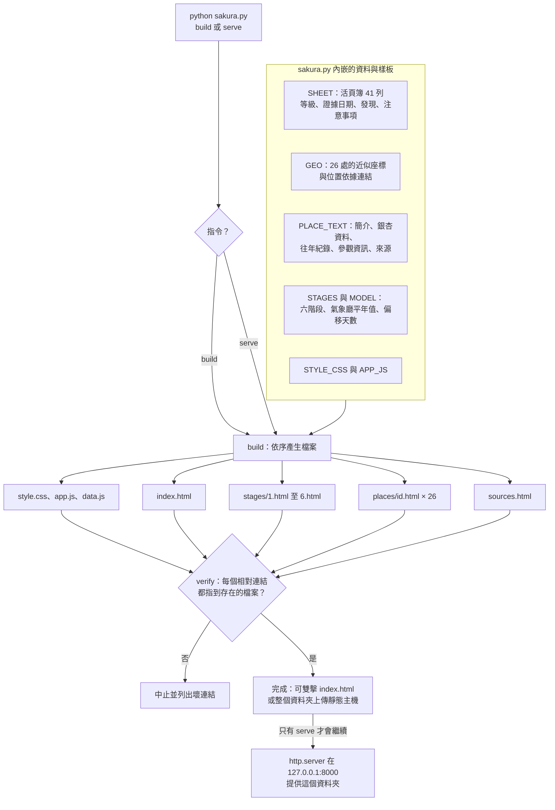
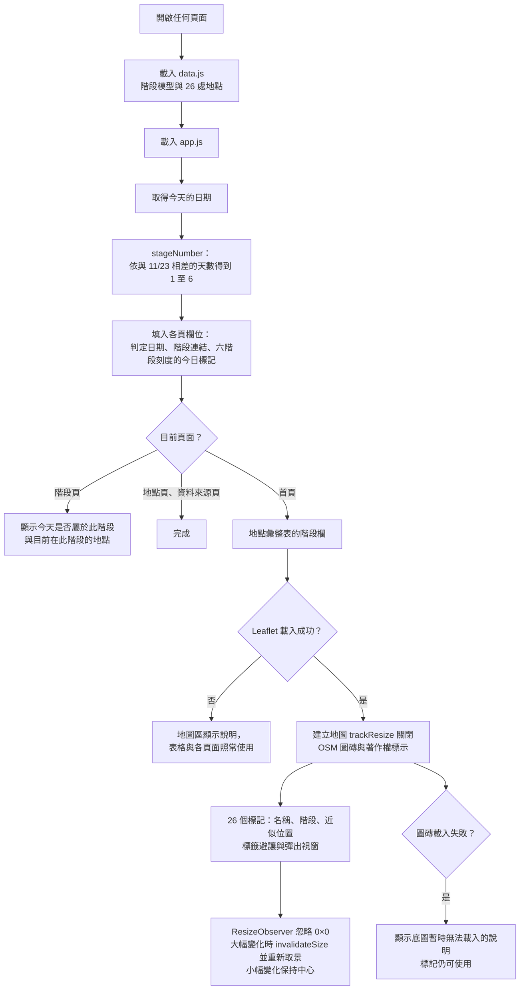
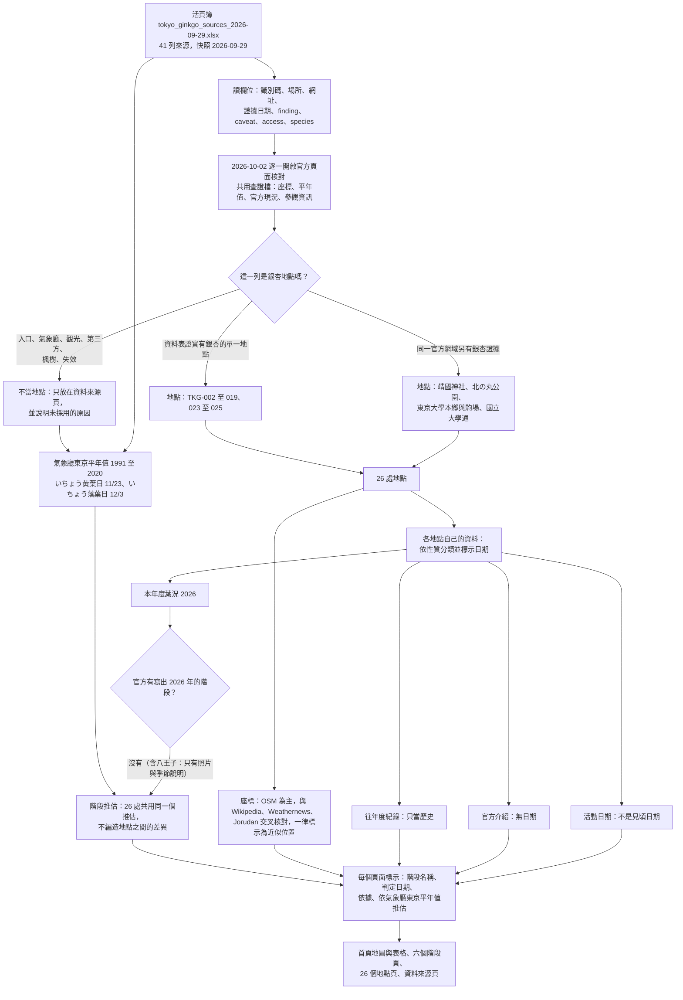
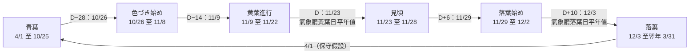
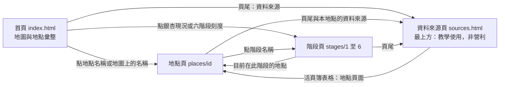

# ARCHITECTURE：東京銀杏一年生長階段情報

這份文件用 Mermaid 記錄網站的程式流程與資料查證流程，並說明網站頁面、資料來源、階段判定與畫面呈現之間的關係。

網站的主程式是 `sakura.py`（只用 Python 標準庫）。它把資料、頁面樣板、樣式與腳本放在同一個檔案裡，執行後產生可以直接放到靜態主機的網站。

## 1. 怎麼啟動

| 指令 | 作用 |
| --- | --- |
| `python sakura.py build` | 產生網站到 `sakura.py` 所在的資料夾，並檢查所有相對連結都指到存在的檔案 |
| `python sakura.py serve` | 先 build，再開啟本機伺服器 `http://localhost:8000/`（`--port 8080` 可改連接埠，Ctrl+C 結束） |
| 雙擊 `index.html` | 不需要伺服器，所有連結都是相對路徑，用 `file://` 也能開啟 |

## 2. 產生的檔案

| 檔案 | 內容 |
| --- | --- |
| `index.html` | 首頁：標題、六階段刻度、OpenStreetMap 地圖、地點彙整表、頁尾「資料來源」 |
| `stages/1.html` … `stages/6.html` | 六個生長階段的詳細頁 |
| `places/<id>.html` | 26 處地點的詳細頁（`<id>` 是資料表的來源識別碼，例如 `tkg-015`） |
| `sources.html` | 資料來源頁，最上方是「教學使用，非營利」 |
| `style.css`、`app.js`、`data.js` | 樣式、共用腳本、網站資料（階段模型與 26 處地點） |

## 3. 圖 1：程式流程（sakura.py 產生網站）

## 4. 圖 2：瀏覽器端流程（階段與地圖在開啟頁面時計算）

階段不寫死在 HTML 裡，而是在瀏覽器依「開啟頁面當天的日期」計算，所以網站不需要重新產生，隨著時間過去仍然正確。

## 5. 圖 3：資料查證流程（活頁簿到網頁）

## 6. 圖 4：階段判定（氣象廳平年值換算）

D 是氣象廳東京「いちょう黄葉日」的平年值 11/23。見頃從 D 開始，落葉從「いちょう落葉日」的平年值 12/3（D+10）開始；其餘三個邊界是示意參數。

## 7. 圖 5：頁面之間的連結

## 8. 階段、資料來源與畫面的對應

| 項目 | 來源 | 在畫面上怎麼呈現 |
| --- | --- | --- |
| 階段名稱 | 氣象廳東京平年值換算（圖 4） | 首頁表格的「銀杏現況」欄只顯示階段名稱；地圖標記、彈出視窗、地點頁、階段頁都用同一個計算結果 |
| 判定日期 | 開啟頁面當天的日期 | 地點頁的「判定日期」、首頁的「今日」、地圖彈出視窗 |
| 判定依據 | 氣象廳（JMA）東京いちょう黄葉日、落葉日平年值 | 欄位標題與表格上方的說明寫「依氣象廳東京平年值推估」；地點頁與階段頁寫明基準與示意參數 |
| 該地點自己的資料 | 活頁簿的列、官方頁面 | 地點頁「自己的最新資料」：本年度葉況、往年度紀錄、官方介紹、活動日期，各有日期與類型標籤 |
| 位置 | 共用查證檔的座標與位置依據 | 地圖標記與地點頁的「位置與精度」，標示「近似位置」，不說成銀杏樹的精確座標 |
| 全部來源 | 活頁簿 41 列、氣象廳、各地點官方頁面、OSM 等 | `sources.html`，最上方「教學使用，非營利」 |

## 9. 假設與選擇（單回合建置時採保守做法）

BRIEF 的第 2 條規則是「有疑慮的任務就停下來詢問」。這次是單回合建置，無法來回詢問，所以遇到下面這些模糊處時，一律選擇最保守、最不會誤導的做法，並記在這裡。

1. **階段是推估，不是各地點的觀測。** BRIEF 要求每處地點直接呈現六個階段之一，但活頁簿與官方頁面（2026-10-02 查核）都沒有 2026 年各地點的銀杏階段，連唯一有 2026 內容的八王子也只有照片與季節說明。所以用氣象廳東京平年值推估共通階段，每個出現階段的地方都標示「依氣象廳東京平年值推估」。
2. **26 處地點共用同一個階段。** 不編造地點之間的差異；地點之間的差別只在「自己的資料」。
3. **過去的紀錄只當歷史。** 例如新宿御苑 2025-11-28 的見頃、明治神宮外苑 2022-11-17 的見頃，都標日期與「往年度紀錄」，不當成現況。活動日期（祭典、點燈、集章）不是見頃日期。
4. **模型只涵蓋秋季。** 氣象廳平年值只提供 11/23 與 12/3。沒有「光禿禿的冬天」這個階段，所以 1 月到 3 月沿用落葉；青葉從 4/1 開始是本站的假設，不是觀測值（階段頁有說明）。
5. **邊界的性質分開標示。** 見頃的起點 11/23 與落葉的起點 12/3 取自氣象廳；其餘三個邊界（D−28、D−14、D+6）是示意參數。近年東京黃葉日的起伏很大（2023 年 12/1、2024 年 12/3、2025 年 11/22），所以實際季節可能前後差約一週。
6. **日期用瀏覽器的本地日期。** 跨時區在午夜附近可能差一天。
7. **地點篩選。** 取資料表本身證實有銀杏的單一地點（TKG-002 至 019、023 至 025），加上同一官方網域另有銀杏證據的靖國神社、北の丸公園、東京大學本鄉與駒場、國立大學通，共 26 處。皇居外苑（行幸通り一帶）沒有官方文字證實，所以不標示；小石川植物園與小石川後樂園、皇居東御苑與皇居外苑都分開處理。
8. **座標一律是近似位置。** 大型園區只有代表點；線狀並木取中段；有官方文字可循的園內位置（例如新宿御苑的大溫室附近）是推算的概略位置。かたらいのイチョウ並木的位置尚未核實，只用文字說明，不標在地圖上。
9. **活頁簿檔案本身不放進專案。** 資料來自同一份活頁簿的資料列與 2026-10-02 的共用查證結果，整理後內嵌在 `sakura.py`；網站引用的是官方頁面的連結，不是檔案。
10. **查證日期。** 官方頁面的內容以 2026-10-02 的查核為準，之後沒有重新抓取內容；網站建置時只重新檢查了外部連結是否可以開啟。
11. **地圖。** 只使用 OpenStreetMap 官方圖磚並標示著作權；圖磚或 Leaflet 載入失敗時顯示說明，不改用其他底圖。
12. **不使用子代理。** 依 BRIEF 第 1 條規則，整個網站由單一流程完成。

## 10. 完成後的檢查項目

- `python sakura.py build` 沒有錯誤，並且所有相對連結都指到存在的檔案（內建的 verify）。
- `python sakura.py serve` 可以在 `http://localhost:8000/` 開啟首頁、六個階段頁、26 個地點頁與資料來源頁。
- 首頁表格的每個地點連結與階段連結都能開啟；表格、地圖標記、彈出視窗、地點頁、階段頁顯示同一個階段；模擬 2026-11-25 時，所有地方都變成「見頃」。
- 地圖在手機與桌面寬度、視窗大小變化、圖磚或 Leaflet 被封鎖時都能運作。
- 本文件的 Mermaid 圖可以被 Mermaid 正常轉譯。
